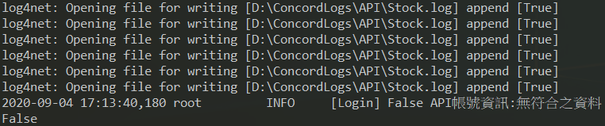

## FAQ
This Frequently Asked Questions (FAQ) page provides solutions while encountered the error.

### Installation
- Not install Concord.API.Stock.Setup.msi

    !!! danger "Error"
          
    !!! Note "How to solve"
        Download [Concord.API.Stock.Setup.msi](./Concord.API.Stock.Setup.msi) and execute the file.
        Follow the steps, to install it correctly. 
        
### Login API
- Account is not {==active==} for API.  

    !!! danger "Error"
        
    !!! Note "How to solve"
        This error means your trading account is not active for API. 
        The procedure of apply is list [here](https://www.concords.com.tw/trade_071.html).
        Follow the steps, will active the account for API.
        
        !!! Warning
            If after following the instruction of applying the account, still show up this error please contact us.

- The {==certification==} for online place order is {==expired==}. 
 
    !!! danger "Error"
        
    !!! Note "How to solve"
        Reapply from here [Certuficate Enrollment System](https://raweb.concords.com.tw/RAWEB/CertSearch.jsp).
    
-   

 

    [🏠 Back to main page](index.md)
    
        <a href="#top">⮉Back to top</a>
    

