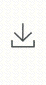

## Summarized table
All functions provide for trading API are summarized in this table. 
Click the link below the category title can downlaod the csv file of functions' summarized table.  

---   
### Stock
#### Trading method
[Download file](./stock_method.csv)  

{{ read_csv('stock_method.csv', keep_default_na=False, na_values=[' ']) }}

#### Event subscribe
[Download file](./stock_event.csv)

{{ read_csv('stock_event.csv') }}

### Futures
#### Trading method
[Download file](./fu_method.csv)

{{ read_csv('fu_method.csv') }}

#### Event subscribe
[Download file](./fu_event.csv)

{{ read_csv('fu_event.csv') }}

### Foreign Futures
#### Trading method
[Download file](./foreign_fu_method.csv)

{{ read_csv('foreign_fu_method.csv', keep_default_na=False, na_values=[' ']) }}

#### Event subscribe
[Download file](./foreign_fu_event.csv)

{{ read_csv('foreign_fu_event.csv') }}

 

    [🏠 Back to main page](../index.md)
    
        <a href="#top">⮉Back to top</a>
    

